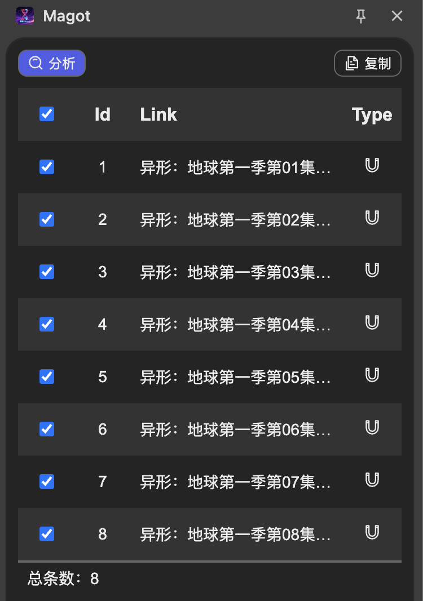

# Magot - 磁力链接提取器

[](https://opensource.org/licenses/Apache-2.0)
[](https://gitee.com/ourcolour/magot)
[](https://github.com/ourcolour/magot)

一款用于Chrome和Firefox浏览器的智能链接提取插件，能够自动识别并提取网页中的下载链接。



## 功能特性

- 🔍 **智能分析** - 自动扫描当前网页中的磁力、BT、FTP下载链接
- 📋 **一键复制** - 将提取的链接自动复制到系统剪贴板
- 🎯 **简洁界面** - 直观的操作界面，轻松管理提取结果
- 🔄 **灵活选择** - 支持一键复制全部链接或自定义选择特定链接

## 支持的链接类型

- **磁力链接** (magnet:?xt=urn:btih:)
- **BT种子** (.torrent文件链接)
- **FTP链接** (ftp://)
- **其他下载协议链接**

## 安装方法

### Chrome浏览器安装

1. 下载插件压缩包并解压
2. 打开Chrome浏览器，访问 `chrome://extensions/`
3. 开启右上角的"开发者模式"
4. 点击"加载已解压的扩展程序"，选择解压后的插件文件夹

### Firefox浏览器安装

1. 下载插件压缩包并解压
2. 打开Firefox浏览器，访问 `about:debugging`
3. 点击"此Firefox"
4. 点击"临时加载扩展程序"，选择解压后的插件文件夹

## 使用方法

1. **打开目标网页** - 访问包含下载链接的网页
2. **点击插件图标** - 点击浏览器工具栏中的Magot插件图标
3. **开始分析** - 在弹出的界面中点击【分析】按钮
4. **自动复制** - 插件将自动提取所有链接并复制到剪贴板

## 项目结构

将选中的项目结构部分转换为表格形式：

| 路径                            | 类型 | 描述                   |
| ------------------------------- | ---- | ---------------------- |
| magot/                          | 目录 | 项目根目录             |
| src/                            | 目录 | 源代码目录             |
| src/css/                        | 目录 | 样式文件目录           |
| src/css/common.scss             | 文件 | 通用样式（SCSS源文件） |
| src/css/common.css              | 文件 | 编译后的通用样式       |
| src/css/common.css.map          | 文件 | Source map文件         |
| src/css/media.scss              | 文件 | 媒体查询样式           |
| src/css/media.css               | 文件 | 编译后的媒体样式       |
| src/css/media.css.map           | 文件 | Source map文件         |
| src/css/sidebar.scss            | 文件 | 侧边栏样式             |
| src/css/sidebar.css             | 文件 | 编译后的侧边栏样式     |
| src/css/sidebar.css.map         | 文件 | Source map文件         |
| src/icons/                      | 目录 | 图标资源目录           |
| src/icons/SVG/                  | 目录 | SVG矢量图标目录        |
| src/icons/SVG/icon-download.svg | 文件 | 下载图标               |
| src/icons/SVG/icon-refresh.svg  | 文件 | 刷新图标               |
| src/icons/SVG/icon-settings.svg | 文件 | 设置图标               |
| src/icons/icon.png              | 文件 | 主图标                 |
| src/icons/icon_16.png           | 文件 | 16x16图标              |
| src/icons/icon_48.png           | 文件 | 48x48图标              |
| src/icons/icon_128.png          | 文件 | 128x128图标            |
| src/js/                         | 目录 | JavaScript脚本目录     |
| src/js/bg.js                    | 文件 | 后台脚本（背景页）     |
| src/js/cs.js                    | 文件 | 内容脚本               |
| src/js/iconpark.js              | 文件 | 图标库相关脚本         |
| src/js/sidebar.js               | 文件 | 侧边栏功能脚本         |
| src/js/utils.js                 | 文件 | 工具函数               |
| src/js/sidebar.html             | 文件 | 侧边栏HTML界面         |
| LICENSE                         | 文件 | Apache-2.0许可证文件   |
| manifest.json                   | 文件 | 浏览器插件清单文件     |
| README.md                       | 文件 | 项目说明文档           |
| screen.png                      | 文件 | 插件截图               |

## 开发说明

### 构建与编译

```bash
# 克隆项目
git clone https://gitee.com/ourcolour/magot.git
# （或者使用GitHub）
git clone https://github.com/ourcolour/magot.git

# 进入目录
cd magot

# 安装依赖（如有）
npm install

# 编译SCSS文件（需要Sass编译器）
sass src/css/common.scss src/css/common.css
sass src/css/media.scss src/css/media.css
sass src/css/sidebar.scss src/css/sidebar.css
```

### 本地测试

1. 按照上述安装方法加载解压后的插件文件夹
2. 在浏览器中访问测试网页验证功能
3. 打开开发者工具查看控制台输出

## 技术架构

- **manifest.json** - 定义插件的基本信息和权限
- **bg.js** - 后台脚本，处理剪贴板操作和持久化数据
- **cs.js** - 内容脚本，注入页面并分析链接
- **sidebar.html/js** - 侧边栏用户界面
- **SCSS/CSS** - 使用Sass预处理器管理样式

## 参与贡献

我们热烈欢迎社区贡献！以下是参与方式：

### 如何贡献

- 报告问题: 提交 Issue反馈bug或建议
- 改进文档: 完善使用指南、API文档或翻译
- 代码贡献: 实现新功能或修复问题
- 测试帮助: 测试不同数据库兼容性或边缘情况

### 开发流程

1. Fork 本仓库并创建特性分支：
   ```shell
   git checkout -b feature/你的功能名称
   ```
2. 提交代码变更：
   ```shell
   git commit -m 'feat: 添加新功能描述'
   ```
3. 推送到分支并创建Pull Request：
   ```shell
   git push origin feature/你的功能名称
   ```
4. 等待代码审查和合并

### 代码规范

- 遵循Go语言官方代码规范
- 提交信息遵循Conventional Commits规范
- 确保新增代码包含适当测试用例
- 更新相关文档和示例

## 许可证

本项目采用 Apache License 2.0 开源许可证。详情请参阅 [LICENSE](LICENSE) 文件。

## 更新日志

### v1.0.0

- 初始版本发布
- 支持磁力、BT、FTP链接提取
- 支持剪贴板自动复制功能
- 响应式侧边栏界面

## 问题反馈

如果您遇到问题或需要帮助：

- 查看 Wiki文档获取详细指南
- 提交 Issue报告问题
- 加入讨论区交流使用经验

## 免责声明

本插件仅用于技术学习和合法用途。使用者应遵守当地法律法规，不得用于侵犯版权的非法下载。开发者不对使用者的行为承担任何责任。

---

**注意**: 请确保您拥有下载内容的合法权限，并遵守相关法律法规。

